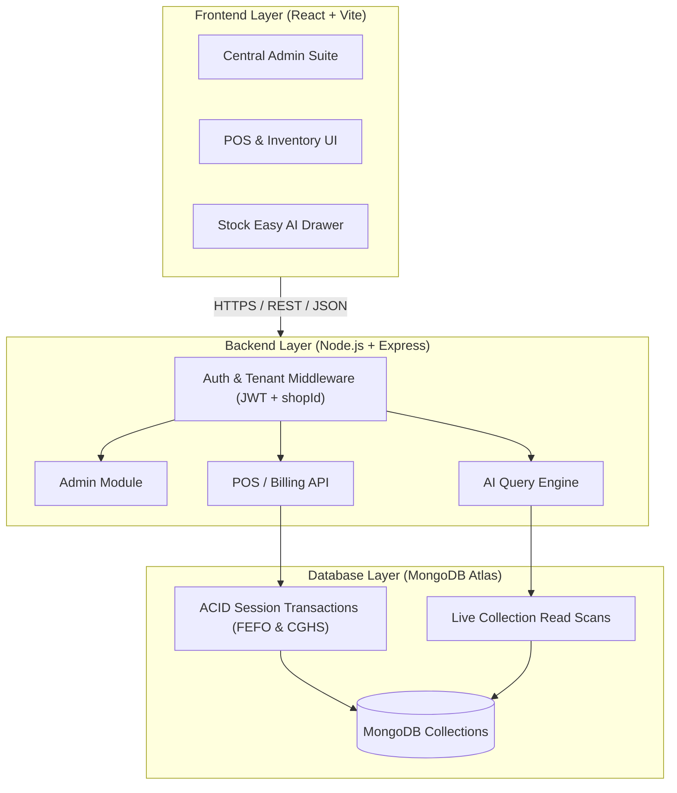
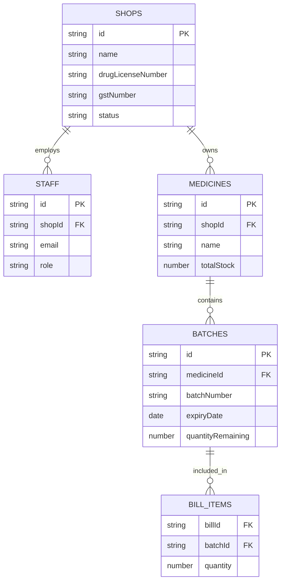

# **Pharma Pulse — Stock Easy** 💊📈

> **A Complete Multi-Tenant Pharmacy SaaS Platform** featuring **FEFO-based automated inventory allocation**, **CGHS split-billing calculations**, **real-time operational analytics**, and an integrated **AI assistant** powered by grounded live database queries.

---

## **📌 Executive Summary**

**Pharma Pulse — Stock Easy** is an end-to-end, multi-tenant **B2B SaaS ecosystem** built to modernize retail pharmacy operations and regulatory compliance. Designed with enterprise-grade **multi-tenancy**, it provides a centralized platform for **store onboarding**, **regulatory verification**, **inventory ledger tracking with strict compliance logic**, **point-of-sale (POS) operations**, and **automated AI insights**.

The platform addresses core pharmaceutical retail friction points:
* **Strict Expiry & Inventory Tracking:** Enforces **First-Expiry-First-Out (FEFO)** batch selection inside atomic database transactions to eliminate stock waste.
* **Complex Billing Schemes:** Seamlessly handles Central Government Health Scheme (**CGHS 80/20**) co-pay splits directly at POS checkout.
* **Context-Aware AI Intelligence:** Delivers natural language query capabilities over real-time operational database states without hallucination risk.

---

## **🛠 Tech Stack**

| **Domain** | **Technologies & Libraries** |
| :--- | :--- |
| **Frontend UI** | **React 18**, **Vite**, **TypeScript**, **Tailwind CSS**, **Lucide Icons**, Glassmorphism UI |
| **Backend & REST APIs** | **Node.js**, **Express.js**, **JavaScript (ES6+)** |
| **Database & ORM** | **MongoDB Atlas**, **Mongoose** (**ACID Multi-Document Transactions**) |
| **Authentication & Security** | **JWT (JSON Web Tokens)**, **OAuth 2.0 / Passport.js (Google Integration)** |
| **AI & Natural Language** | **Custom Grounded RAG Query Engine** (Mongo-Grounded Natural Language Processing) |
| **DevOps & Tooling** | **Docker**, **Git**, **Nodemon**, **dotenv**, RESTful Architecture |

---

## **📸 System Previews**

| **Platform Suite** | **Interface Preview** |
| :--- | :--- |
| **Central Admin Suite**<br>*
| **Point of Sale (POS) Terminal**<br>*(Live Search & CGHS Split Billing)* | 
| **Inventory Ledger**<br>*(FEFO Batch & Expiry Management)* | ` 
| **Stock Easy AI Assistant**<br>*(Grounded Natural Language Analytics)* |

---

## **🚀 Key Architectural Features**

### **1. Multi-Tenant Central Admin & Verification Pipeline**
* **Tenant Isolation:** Enforces strict logical data segregation across shop domains via indexed **`shopId`** references.
* **4-Step Onboarding & Regulatory Verification:** Streamlined registration capturing business, **PAN**, **GSTIN**, and **drug license details**, locking access behind a **Pending Lockout Screen** with automated background polling until explicit admin approval.
* **SaaS Analytics Suite:** Monitors **Global Tenant Count**, **Monthly Recurring Revenue (MRR)**, and platform-wide growth metrics.

### **2. Transactional POS & FEFO Inventory Engine**
* **ACID Transaction Checkout:** Executes `POST /api/bills/checkout` within **MongoDB session transactions**, ensuring all-or-nothing stock decrements.
* **Automated FEFO Allocation:** Queries non-expired batches sorted by **`{ expiryDate: 1 }`** and sequentially satisfies line item quantities to ensure regulatory compliance.
* **CGHS 80/20 Split Billing:** Calculates and documents real-time co-pay partitions (**80% CGHS / 20% Patient share**) recorded within sub-documents for auditability.

### **3. Stock Easy Grounded AI Assistant**
* **Database-Grounded Querying:** Translates natural language prompts into targeted aggregation queries directly against MongoDB collections.
* **Contextual Store Insights:** Delivers instant operational visibility into **near-expiry batches**, **daily revenue performance**, and **reorder alerts**.

---

### **🏗 System Architecture**



---

### **🗄️ Database ER Diagram & Schema Design**



---

## **🔒 Security & Multi-Tenancy Architecture**

* **Tenant Isolation:** Data leakage is prevented at the database queries layer. Every API route passes through a **Tenant Context Middleware** that extracts `shopId` from the verified **JWT payload**, appending it to all **Mongoose queries** (`{ shopId: req.user.shopId }`).
* **ACID Transactions:** High-frequency checkout operations (`POST /api/bills/checkout`) use **MongoDB Client Sessions** to guarantee atomic multi-document writes across `Batches` and `Bills`.
* **RBAC (Role-Based Access Control):** Differentiates permissions between **Central Admin** (global metrics, tenant approvals) and **Shop Owners/Staff** (POS access, stock updates).
* **Grounded AI Guardrails:** The **Stock Easy AI Assistant** evaluates user intents via deterministic database aggregations, completely mitigating prompt injection and LLM hallucination risks.

---


## **🔄 User Journeys & Workflow**

[ Central Admin Workflow ]
Seed Admin Login ──► Admin Suite Overview ──► Verification Queue ──► Approve / Reject Pending Shops

[ Shop Owner Onboarding Workflow ]
Google Sign-In ──► 4-Step Onboarding ──► Pending Lockout Screen ──► Automated Polling ──► Approved Dashboard

[ Active Shop Operations ]
POS Terminal (FEFO Checkout & CGHS Split) ◄──► Live Inventory Ledger ◄──► Stock Easy AI Insights


---

## **🛠 API Architecture & Route Map**

### **🔐 Authentication & Onboarding**
* **`POST /api/auth/admin/login`** — Central admin credential authentication
* **`POST /api/auth/google`** — OAuth 2.0 / Mock Google sign-in & user upsert
* **`POST /api/auth/onboarding`** — Submits 4-step pharmacy registration
* **`GET /api/auth/me`** — Retrieves current user profile and associated tenant context

### **🛡 Central Admin Suite**
* **`GET /api/admin/metrics`** — Fetches global platform KPIs and MRR breakdown
* **`GET /api/admin/verification-queue`** — Retrieves pending tenant applications
* **`PATCH /api/admin/shops/:id/approve`** — Approves pending pharmacy application
* **`PATCH /api/admin/shops/:id/reject`** — Rejects application with reason tracking
* **`PATCH /api/admin/shops/:id/subscription`** — Updates tenant subscription tier

### **📦 Inventory & FEFO Engine**
* **`GET /api/medicines`** — Lists catalog medicines with total aggregated stock
* **`GET /api/medicines/search?q=`** — Debounced search endpoint for live POS terminal
* **`POST /api/batches`** — Creates new inventory batch / Goods Received Note (GRN)
* **`GET /api/batches?filter=`** — Filters ledger by **Expiring Soon**, **Out of Stock**, or **Dead Stock**
* **`POST /api/bills/checkout`** — Executes transactional FEFO-based POS checkout

### **🤖 Stock Easy AI Engine**
* **`POST /api/ai/ask`** — Evaluates grounded natural language queries against operational data
* **`GET /api/ai/history`** — Fetches historical AI interactions per session

## **⚡ Quick Start Guide**

### **Prerequisites**
* **Node.js**: `v18.0.0` or higher
* **MongoDB**: Atlas Cluster (or local replica set supporting transactions)

### **Environment Setup (`backend/.env`)**

```env
PORT=5000
CLIENT_ORIGIN=http://localhost:3000
MONGO_URI=mongodb+srv://<user>:<password>@<cluster>/pharma-pulse?retryWrites=true&w=majority
JWT_SECRET=your_super_secret_jwt_key_here
JWT_EXPIRES_IN=7d
ADMIN_SEED_EMAIL=admin@pharmapulse.com
ADMIN_SEED_PASSWORD=ChangeMe123!
GOOGLE_AUTH_MODE=mock
Installation & Execution
Bash
# 1. Clone the repository
git clone [https://github.com/Meghali54/Stock-Easy.git](https://github.com/Meghali54/Stock-Easy.git)
cd Stock-Easy/pharma-pulse-workspace

# 2. Setup and run Backend
cd backend
npm install
node seed.js    # Seed initial Central Admin account
npm run dev     # Starts server on http://localhost:5000

# 3. Setup and run Frontend (in a new terminal tab)
cd ../frontend
npm install
npm run dev     # Starts application on http://localhost:3000
📄 License
Distributed under the MIT License. See LICENSE for details.
